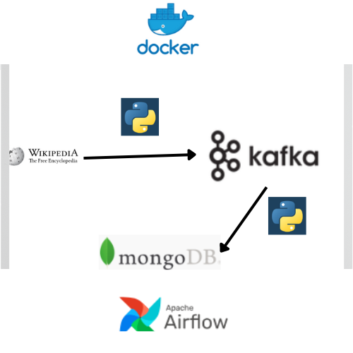

# Pipeline_with_Airflow
This repository contains a complete data processing pipeline leveraging the power of Apache Airflow for workflow orchestration, Apache Kafka for message streaming, and MongoDB for data storage. The pipeline is designed to scrape web data, process, an itd lot iad into a database for further analysis or visualization.

## Key Features:
Web Scraping: Automates the extraction of data from major companies from Wikipedia, ensuring the retrieval of the most up-to-date information.
Data Streaming with Kafka: Uses Apache Kafka for efficient management of streaming data, ensuring smooth data production and consumption.
Data Transformation: Implements simple cleaning and transformation operations to prepare the data for storage.
MongoDB Integration: Loads the processed data into MongoDB, a NoSQL database, for easy persistence and retrieval.
Workflow Orchestration with Airflow: Orchestrates the entire data pipeline using Apache Airflow, allowing for scheduled and reliable execution of data processing tasks.

## Technologies:
Python 3.x: For scripting the web scraping, data transformation, and interactions with Kafka and MongoDB.
Apache Airflow (Docker): Orchestrates the data pipeline workflow, ensuring scheduled and reliable task execution.
Apache Kafka (Docker): Manages streaming data between the scraping and loading phase, offering a robust messaging system.
MongoDB: Stores transformed data in a NoSQL database, allowing for efficient data retrieval and analysis.
BeautifulSoup: Parses HTML and XML documents in the web scraping phase, simplifying data extraction from web pages.
Docker: Containerizes the entire application and its dependencies, ensuring consistent execution environments and simplifying deployment and scaling.

## Deployment
To get started with this project:

Docker: Ensure Docker is installed on your system. Use Docker to deploy Apache Airflow, Apache Kafka, and MongoDB using provided configuration files and commands.
Local Configuration: Set up your local Python environment to run the necessary scripts for scraping and transforming data. Make sure all required dependencies are installed.

# Launching the Pipeline:
Start Docker services (Airflow, Kafka, MongoDB) with Docker Compose.
Execute the scraping, transformation, and loading tasks either via Airflow or manually from your local machine, depending on the specific project setup.

# Tips:
Refer to the docker-compose.yml file for Docker configurations.
For persistent storage, consider setting up Docker volumes for MongoDB and Kafka data.
Ensure to follow specific instructions for configuring and running the local components of your project.
